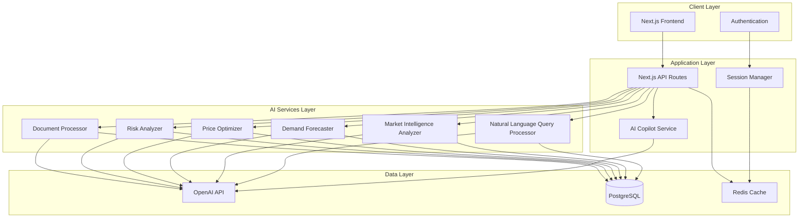
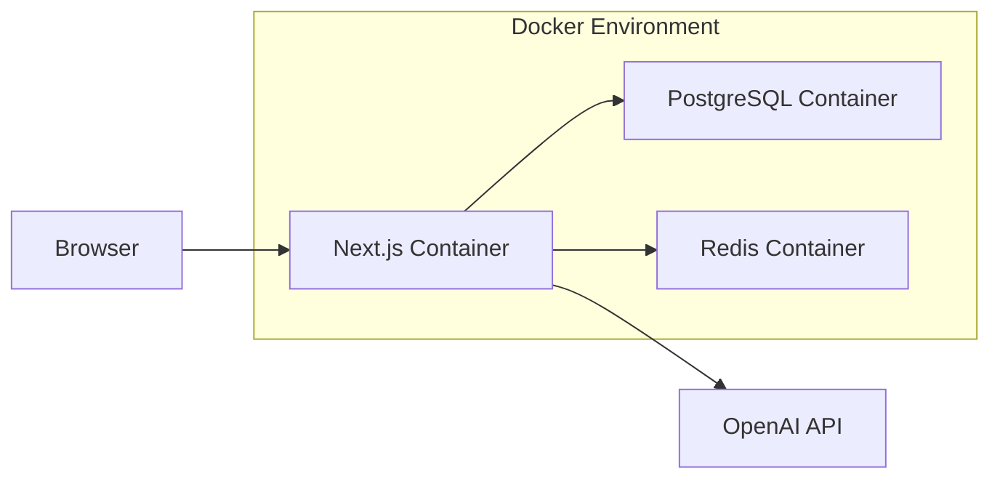

# Design Document: AI-Powered Retail Intelligence Platform

## Overview

The AI-Powered Retail Intelligence Platform is a Next.js-based web application that provides retail teams, marketplace operators, and small business owners with AI-driven insights for decision-making. The platform uses OpenAI's API to translate natural language queries into database operations, analyze business data, and generate actionable recommendations across multiple domains: market intelligence, customer insights, pricing optimization, risk analysis, and document understanding.

The architecture emphasizes security (session-only API key storage), scalability (Docker containerization), and transparency (explainable AI recommendations). The system is designed to demonstrate meaningful AI usage beyond simple rule-based logic, focusing on complex pattern recognition, natural language understanding, and predictive analytics.

## Architecture

### High-Level Architecture



### Technology Stack

- **Frontend/Backend**: Next.js 14+ (App Router)
- **Database**: PostgreSQL 15+
- **AI Provider**: OpenAI API (GPT-4 or GPT-4-turbo)
- **Session Storage**: Redis (for API key and session data)
- **Containerization**: Docker and Docker Compose
- **ORM**: Prisma (for type-safe database access)
- **Authentication**: NextAuth.js
- **Visualization**: Recharts or Chart.js

### Deployment Architecture



## Components and Interfaces

### 1. Session Manager

**Purpose**: Manages user sessions and securely stores API keys in memory only.

**Interface**:
```typescript
interface SessionManager {
  // Store API key for the current session
  setApiKey(sessionId: string, apiKey: string): Promise<void>
  
  // Retrieve API key for the current session
  getApiKey(sessionId: string): Promise<string | null>
  
  // Validate API key format
  validateApiKey(apiKey: string): boolean
  
  // Delete API key when session ends
  deleteApiKey(sessionId: string): Promise<void>
  
  // Check if session has valid API key
  hasValidApiKey(sessionId: string): Promise<boolean>
}
```

**Implementation Notes**:
- Uses Redis with TTL (time-to-live) for automatic expiration
- API keys stored with session ID as key
- No persistence to disk or database
- Encryption at rest in Redis using AES-256

### 2. Natural Language Query Processor

**Purpose**: Translates natural language queries into SQL and executes them safely.

**Interface**:
```typescript
interface QueryProcessor {
  // Process natural language query
  processQuery(
    query: string,
    userId: string,
    sessionId: string
  ): Promise<QueryResult>
  
  // Validate generated SQL for safety
  validateSQL(sql: string): ValidationResult
  
  // Execute SQL with user permissions
  executeSQL(
    sql: string,
    userId: string
  ): Promise<DatabaseResult>
}

interface QueryResult {
  data: any[]
  explanation: string
  sqlGenerated: string
  executionTime: number
}

interface ValidationResult {
  isValid: boolean
  errors: string[]
  warnings: string[]
}
```

**Implementation Notes**:
- Uses OpenAI function calling to generate SQL
- Implements SQL injection prevention through parameterized queries
- Enforces row-level security based on user permissions
- Logs all queries for audit trail
- Provides query explanation in natural language

### 3. Market Intelligence Analyzer

**Purpose**: Analyzes market trends and generates forecasts.

**Interface**:
```typescript
interface MarketIntelligence {
  // Analyze market trends
  analyzeMarketTrends(
    region: string,
    category: string,
    timeframe: TimeRange
  ): Promise<MarketAnalysis>
  
  // Generate market forecast
  generateForecast(
    category: string,
    horizon: number
  ): Promise<Forecast>
  
  // Compare regional markets
  compareMarkets(
    regions: string[],
    metrics: string[]
  ): Promise<MarketComparison>
}

interface MarketAnalysis {
  trends: Trend[]
  insights: Insight[]
  confidence: number
  dataPoints: number
  lastUpdated: Date
}

interface Forecast {
  predictions: Prediction[]
  confidence: number
  factors: string[]
  methodology: string
}
```

**Implementation Notes**:
- Retrieves historical market data from database
- Uses OpenAI to identify patterns and anomalies
- Generates visualizations for trend display
- Updates forecasts based on new data
- Provides confidence intervals for predictions

### 4. Demand Forecaster

**Purpose**: Predicts product demand based on historical data and market conditions.

**Interface**:
```typescript
interface DemandForecaster {
  // Forecast demand for products
  forecastDemand(
    productIds: string[],
    horizon: number,
    granularity: 'daily' | 'weekly' | 'monthly'
  ): Promise<DemandForecast>
  
  // Analyze customer segments
  analyzeCustomerSegments(
    criteria: SegmentCriteria
  ): Promise<CustomerSegments>
  
  // Detect demand anomalies
  detectAnomalies(
    productId: string,
    threshold: number
  ): Promise<Anomaly[]>
}

interface DemandForecast {
  productId: string
  predictions: DemandPrediction[]
  confidence: number
  influencingFactors: Factor[]
  recommendations: string[]
}

interface CustomerSegments {
  segments: Segment[]
  characteristics: Map<string, any>
  insights: string[]
}
```

**Implementation Notes**:
- Analyzes historical sales, seasonality, and trends
- Incorporates external factors (market trends, events)
- Uses AI to identify non-obvious patterns
- Generates alerts for significant demand changes
- Segments customers using clustering algorithms

### 5. Price Optimizer

**Purpose**: Recommends optimal pricing strategies based on market conditions.

**Interface**:
```typescript
interface PriceOptimizer {
  // Generate pricing recommendations
  recommendPricing(
    productId: string,
    objectives: PricingObjective[]
  ): Promise<PricingRecommendation>
  
  // Analyze competitor pricing
  analyzeCompetitorPricing(
    productId: string,
    competitors: string[]
  ): Promise<CompetitorAnalysis>
  
  // Calculate price elasticity
  calculateElasticity(
    productId: string,
    priceRange: [number, number]
  ): Promise<ElasticityAnalysis>
}

interface PricingRecommendation {
  recommendedPrice: number
  priceRange: [number, number]
  expectedImpact: Impact
  rationale: string[]
  confidence: number
}

interface CompetitorAnalysis {
  competitors: CompetitorPrice[]
  marketPosition: string
  opportunities: string[]
}
```

**Implementation Notes**:
- Retrieves competitor pricing data
- Analyzes demand elasticity from historical data
- Uses AI to recommend optimal price points
- Considers multiple objectives (revenue, market share, margin)
- Explains pricing rationale clearly

### 6. Risk Analyzer

**Purpose**: Identifies business risks and compliance issues.

**Interface**:
```typescript
interface RiskAnalyzer {
  // Analyze business risks
  analyzeRisks(
    scope: RiskScope
  ): Promise<RiskAssessment>
  
  // Check compliance
  checkCompliance(
    regulations: string[]
  ): Promise<ComplianceReport>
  
  // Generate mitigation strategies
  generateMitigations(
    riskId: string
  ): Promise<MitigationStrategy[]>
}

interface RiskAssessment {
  risks: Risk[]
  overallScore: number
  prioritizedActions: Action[]
  lastAssessed: Date
}

interface Risk {
  id: string
  category: string
  severity: 'low' | 'medium' | 'high' | 'critical'
  likelihood: number
  impact: string
  description: string
}

interface ComplianceReport {
  status: 'compliant' | 'non-compliant' | 'warning'
  violations: Violation[]
  recommendations: string[]
}
```

**Implementation Notes**:
- Monitors business metrics for risk indicators
- Checks operations against compliance rules
- Uses AI to identify emerging risks
- Prioritizes risks by severity and likelihood
- Generates actionable mitigation strategies

### 7. Document Processor

**Purpose**: Extracts insights from business documents.

**Interface**:
```typescript
interface DocumentProcessor {
  // Process uploaded document
  processDocument(
    file: File,
    userId: string
  ): Promise<DocumentAnalysis>
  
  // Extract structured data
  extractData(
    documentId: string,
    schema: DataSchema
  ): Promise<ExtractedData>
  
  // Answer questions about document
  queryDocument(
    documentId: string,
    question: string
  ): Promise<DocumentAnswer>
}

interface DocumentAnalysis {
  documentId: string
  summary: string
  keyPoints: string[]
  extractedData: Map<string, any>
  confidence: number
}

interface DocumentAnswer {
  answer: string
  sources: DocumentSection[]
  confidence: number
}
```

**Implementation Notes**:
- Supports PDF, DOCX, XLSX, CSV formats
- Uses OpenAI vision API for document understanding
- Extracts structured data into database
- Maintains document context for Q&A
- Provides source citations for answers

### 8. AI Copilot Service

**Purpose**: Provides conversational AI assistance for daily tasks.

**Interface**:
```typescript
interface AICopilot {
  // Process user message
  chat(
    message: string,
    conversationId: string,
    userId: string
  ): Promise<CopilotResponse>
  
  // Get conversation history
  getHistory(
    conversationId: string
  ): Promise<Message[]>
  
  // Clear conversation context
  clearContext(
    conversationId: string
  ): Promise<void>
}

interface CopilotResponse {
  message: string
  suggestions: string[]
  actions: Action[]
  sources: DataSource[]
}

interface Message {
  role: 'user' | 'assistant'
  content: string
  timestamp: Date
}
```

**Implementation Notes**:
- Maintains conversation context within session
- Uses configured system prompts
- References database data in responses
- Provides actionable suggestions
- Asks clarifying questions when needed

### 9. Admin Configuration Service

**Purpose**: Manages system prompt configurations.

**Interface**:
```typescript
interface AdminConfig {
  // Get current system prompts
  getSystemPrompts(): Promise<SystemPrompt[]>
  
  // Update system prompt
  updateSystemPrompt(
    promptId: string,
    content: string,
    userId: string
  ): Promise<SystemPrompt>
  
  // Get prompt version history
  getPromptHistory(
    promptId: string
  ): Promise<PromptVersion[]>
  
  // Activate specific prompt
  activatePrompt(
    promptId: string
  ): Promise<void>
}

interface SystemPrompt {
  id: string
  name: string
  content: string
  isActive: boolean
  version: number
  createdAt: Date
  updatedBy: string
}
```

**Implementation Notes**:
- Stores prompts in database
- Maintains version history
- Validates prompt format
- Applies active prompt to AI interactions
- Restricts access to admin users only

## Data Models

### Database Schema

```typescript
// User and Authentication
model User {
  id: string
  email: string
  name: string
  role: 'user' | 'admin'
  organizationId: string
  createdAt: Date
  updatedAt: Date
  
  organization: Organization
  queries: Query[]
  documents: Document[]
}

model Organization {
  id: string
  name: string
  industry: string
  createdAt: Date
  
  users: User[]
  products: Product[]
  marketData: MarketData[]
}

// Product and Sales Data
model Product {
  id: string
  name: string
  category: string
  price: number
  cost: number
  organizationId: string
  
  organization: Organization
  sales: Sale[]
  priceHistory: PriceHistory[]
}

model Sale {
  id: string
  productId: string
  quantity: number
  revenue: number
  customerId: string
  timestamp: Date
  
  product: Product
  customer: Customer
}

model Customer {
  id: string
  organizationId: string
  segment: string
  lifetimeValue: number
  acquisitionDate: Date
  
  sales: Sale[]
}

// Market Intelligence
model MarketData {
  id: string
  region: string
  category: string
  metric: string
  value: number
  timestamp: Date
  source: string
  organizationId: string
  
  organization: Organization
}

model CompetitorPrice {
  id: string
  productId: string
  competitor: string
  price: number
  timestamp: Date
  source: string
}

// Risk and Compliance
model Risk {
  id: string
  organizationId: string
  category: string
  severity: string
  likelihood: number
  description: string
  status: 'open' | 'mitigated' | 'closed'
  detectedAt: Date
  
  mitigations: Mitigation[]
}

model ComplianceRule {
  id: string
  name: string
  description: string
  regulation: string
  isActive: boolean
}

// Documents
model Document {
  id: string
  userId: string
  filename: string
  fileType: string
  summary: string
  uploadedAt: Date
  
  user: User
  extractedData: ExtractedData[]
}

// System Configuration
model SystemPrompt {
  id: string
  name: string
  content: string
  isActive: boolean
  version: number
  createdAt: Date
  updatedBy: string
  
  versions: PromptVersion[]
}

model PromptVersion {
  id: string
  promptId: string
  content: string
  version: number
  createdAt: Date
  createdBy: string
  
  prompt: SystemPrompt
}

// Audit and Logging
model QueryLog {
  id: string
  userId: string
  query: string
  sqlGenerated: string
  executionTime: number
  timestamp: Date
  success: boolean
}

model AccessLog {
  id: string
  userId: string
  resource: string
  action: string
  timestamp: Date
  ipAddress: string
  success: boolean
}
```

### Session Data Structure (Redis)

```typescript
interface SessionData {
  sessionId: string
  userId: string
  apiKey: string  // Encrypted
  conversationContext: Message[]
  expiresAt: Date
}
```

## Correctness Properties

*A property is a characteristic or behavior that should hold true across all valid executions of a system—essentially, a formal statement about what the system should do. Properties serve as the bridge between human-readable specifications and machine-verifiable correctness guarantees.*


### Property 1: API Key Format Validation
*For any* string input submitted as an API key, the platform should accept it only if it matches the valid OpenAI API key format (starts with "sk-" and has appropriate length and character set).
**Validates: Requirements 1.2**

### Property 2: Session-Only API Key Storage
*For any* API key stored by the platform, it should exist only in session storage (Redis) and never appear in the PostgreSQL database or file system.
**Validates: Requirements 1.3, 1.5**

### Property 3: API Key Cleanup on Session End
*For any* session containing an API key, when the session ends or expires, the API key should be completely removed from session storage.
**Validates: Requirements 1.4**

### Property 4: Natural Language to SQL Translation
*For any* natural language query submitted by a user, the AI engine should generate syntactically valid SQL that can be parsed without errors.
**Validates: Requirements 2.1**

### Property 5: SQL Execution and Results
*For any* valid SQL query generated by the AI engine, executing it against the database should return results or a valid error (not crash or hang).
**Validates: Requirements 2.2**

### Property 6: Query Result Formatting
*For any* database query result, the platform should format it into a structured response (not raw SQL output) with appropriate data types preserved.
**Validates: Requirements 2.3**

### Property 7: Unauthorized Data Access Prevention
*For any* query attempting to access data outside the user's organization or role permissions, the platform should reject the query and create an audit log entry.
**Validates: Requirements 2.5, 10.2**

### Property 8: Error Message Generation
*For any* operation that fails (invalid input, query error, processing failure), the platform should return a descriptive error message rather than exposing internal errors or crashing.
**Validates: Requirements 1.6, 2.6, 13.5**

### Property 9: Market Data Retrieval
*For any* market analysis request, the system should retrieve and include data from the database in the analysis results.
**Validates: Requirements 3.1**

### Property 10: Visualization Data Generation
*For any* market intelligence or analytics request, the platform should generate visualization data structures (chart configurations, data series) suitable for rendering.
**Validates: Requirements 3.3**

### Property 11: Global and Regional Market Coverage
*For any* market analysis request where both global and regional data exist, the analysis should include data from both scopes.
**Validates: Requirements 3.4**

### Property 12: Forecast Confidence Levels
*For any* prediction or forecast generated by the platform (demand, market trends, pricing), the output should include a numerical confidence level and, where applicable, uncertainty ranges.
**Validates: Requirements 3.5, 14.3**

### Property 13: Customer Transaction Analysis
*For any* customer insights request, the platform should analyze and include transaction data from the database in the results.
**Validates: Requirements 4.1**

### Property 14: Historical Data in Demand Forecasts
*For any* demand forecast generated, the system should reference and use historical sales data from the database as input.
**Validates: Requirements 4.2**

### Property 15: Customer Segmentation
*For any* customer insights request, the results should include customer segmentation data with defined segment characteristics.
**Validates: Requirements 4.3**

### Property 16: Configurable Forecast Horizons
*For any* time horizon parameter provided to the demand forecaster (daily, weekly, monthly), the system should generate forecasts for that specific granularity.
**Validates: Requirements 4.4**

### Property 17: Demand Anomaly Alerting
*For any* significant change in demand patterns (exceeding configured thresholds), the platform should generate an alert notification.
**Validates: Requirements 4.5**

### Property 18: Competitor Pricing Analysis
*For any* pricing analysis request, the system should retrieve and include competitor pricing data in the analysis.
**Validates: Requirements 5.1**

### Property 19: Pricing Recommendation Factors
*For any* pricing recommendation generated, the output should reference both demand elasticity and market position as influencing factors.
**Validates: Requirements 5.2**

### Property 20: Competitor Price Comparisons
*For any* pricing insights display, the output should include price comparisons with at least one competitor (when competitor data exists).
**Validates: Requirements 5.3**

### Property 21: Price Point Recommendations
*For any* product pricing request, the system should return a specific recommended price value (not just analysis).
**Validates: Requirements 5.4**

### Property 22: Dynamic Pricing Updates
*For any* change in market data that affects pricing (competitor prices, demand), the pricing recommendations should update to reflect the new conditions.
**Validates: Requirements 5.5**

### Property 23: AI Explainability
*For any* AI-generated recommendation, forecast, or insight, the output should include explanatory text describing the reasoning, factors, or rationale behind the result.
**Validates: Requirements 4.6, 5.6, 6.6, 14.1**

### Property 24: Risk Evaluation from Business Data
*For any* risk analysis request, the system should evaluate business data from the database and identify potential risks.
**Validates: Requirements 6.1**

### Property 25: Compliance Rule Checking
*For any* configured compliance rule, the system should check relevant operations against that rule and report violations.
**Validates: Requirements 6.2**

### Property 26: Risk Prioritization
*For any* set of identified risks, the platform should order them by a combination of severity and likelihood (highest priority first).
**Validates: Requirements 6.3**

### Property 27: Compliance Violation Detection
*For any* operation that violates a configured compliance rule, the system should detect and report the violation.
**Validates: Requirements 6.4**

### Property 28: High-Severity Risk Alerting
*For any* risk identified with "high" or "critical" severity, the platform should generate an immediate alert notification.
**Validates: Requirements 6.5**

### Property 29: Document Text Extraction
*For any* document uploaded in a supported format, the document processor should extract and return text content.
**Validates: Requirements 7.1**

### Property 30: Business Information Extraction
*For any* processed document, the AI engine should identify and extract key business information (metrics, dates, entities) into structured data.
**Validates: Requirements 7.2**

### Property 31: Document Summarization
*For any* document processed, the platform should generate a summary of main points and findings.
**Validates: Requirements 7.3**

### Property 32: Structured Data Persistence
*For any* document containing structured data (tables, forms), the extracted data should be stored in the PostgreSQL database.
**Validates: Requirements 7.5**

### Property 33: Document Question Answering
*For any* question asked about an uploaded document, the AI engine should return an answer based on the document content.
**Validates: Requirements 7.6**

### Property 34: System Prompt Application
*For any* AI engine interaction, the request should include the currently active system prompt configuration.
**Validates: Requirements 8.2, 9.4**

### Property 35: Data Source References
*For any* AI-generated recommendation or insight that uses database data, the output should cite or reference the specific data sources used.
**Validates: Requirements 8.3, 14.2**

### Property 36: Conversation Context Maintenance
*For any* conversation within a session, the AI engine should maintain and use the history of previous messages in that conversation.
**Validates: Requirements 8.4**

### Property 37: Conversational Response Formatting
*For any* AI copilot response, the output should be formatted for conversational display (not raw JSON or technical output).
**Validates: Requirements 8.6**

### Property 38: System Prompt Validation
*For any* system prompt update submitted by an admin, the platform should validate the prompt format and reject invalid prompts with descriptive errors.
**Validates: Requirements 9.2**

### Property 39: System Prompt Persistence
*For any* system prompt saved by an admin, the prompt should be persisted to the database and retrievable.
**Validates: Requirements 9.3**

### Property 40: Active Prompt Selection
*For any* set of configured system prompts, exactly one should be marked as active at any time.
**Validates: Requirements 9.5**

### Property 41: Prompt Version History
*For any* system prompt modification, the platform should create a new version record preserving the previous content.
**Validates: Requirements 9.6**

### Property 42: Credential Verification
*For any* authentication attempt, the platform should verify the provided credentials against stored user records in the database.
**Validates: Requirements 10.1**

### Property 43: Encrypted Connections
*For any* data transmission between client and server, the connection should use HTTPS/TLS encryption.
**Validates: Requirements 10.3**

### Property 44: Audit Logging
*For any* data access operation (read, write, delete), the platform should create an audit log entry with user, resource, action, and timestamp.
**Validates: Requirements 10.4**

### Property 45: Security Violation Blocking
*For any* detected security violation (unauthorized access, injection attempt), the platform should block the action and create an alert.
**Validates: Requirements 10.5**

### Property 46: Data Encryption at Rest
*For any* sensitive data field (API keys in Redis, customer PII, financial data), the stored value should be encrypted.
**Validates: Requirements 10.6**

### Property 47: Metric Change Alerting
*For any* business metric that changes beyond a configured threshold, the platform should generate a real-time alert.
**Validates: Requirements 11.1**

### Property 48: Data Freshness Indicators
*For any* insight or dashboard display, the output should include timestamp metadata indicating when the data was last updated.
**Validates: Requirements 11.2**

### Property 49: Dashboard Refresh Intervals
*For any* configured dashboard refresh interval, the platform should update the dashboard data at that frequency.
**Validates: Requirements 11.4**

### Property 50: Recommendation Outcome Tracking
*For any* recommendation that a user acts upon, the platform should create a tracking record linking the recommendation to the action and eventual outcome.
**Validates: Requirements 11.5**

### Property 51: Performance Monitoring
*For any* request processed by the platform, performance metrics (response time, resource usage) should be collected and stored.
**Validates: Requirements 12.6**

### Property 52: Action Response Feedback
*For any* user action (button click, form submit, query), the platform should return a response within a reasonable timeframe (not hang indefinitely).
**Validates: Requirements 13.3**

### Property 53: Limited Data Indicators
*For any* AI recommendation or prediction based on insufficient data (below threshold), the output should include a warning or indicator about data limitations.
**Validates: Requirements 14.4**

### Property 54: Follow-up Context Provision
*For any* follow-up question about a previous recommendation, the AI engine should provide additional context or explanation.
**Validates: Requirements 14.5**

### Property 55: AI Content Labeling
*For any* content displayed to users, AI-generated content should be clearly marked or labeled as such (distinct from user-entered or system data).
**Validates: Requirements 14.6**

## Error Handling

### Error Categories

1. **Input Validation Errors**
   - Invalid API key format
   - Malformed queries
   - Unsupported file formats
   - Invalid configuration values

2. **Authentication/Authorization Errors**
   - Invalid credentials
   - Expired sessions
   - Insufficient permissions
   - Unauthorized data access attempts

3. **AI Service Errors**
   - OpenAI API failures
   - Rate limiting
   - Invalid API key
   - Timeout errors

4. **Database Errors**
   - Connection failures
   - Query execution errors
   - Constraint violations
   - Transaction failures

5. **Processing Errors**
   - Document parsing failures
   - Data extraction errors
   - Calculation errors
   - Insufficient data for analysis

### Error Handling Strategy

**User-Facing Errors**:
- All errors should return descriptive, actionable messages
- Technical details should be logged but not exposed to users
- Error messages should suggest next steps when possible
- Errors should be categorized by severity (info, warning, error, critical)

**Error Recovery**:
- Transient errors (network, rate limits) should trigger automatic retry with exponential backoff
- Database transactions should use proper rollback on failure
- Session errors should prompt re-authentication
- Partial failures in batch operations should be handled gracefully

**Error Logging**:
- All errors should be logged with context (user, action, timestamp, stack trace)
- Critical errors should trigger alerts to administrators
- Error patterns should be monitored for system health
- Logs should be structured for easy querying and analysis

**Graceful Degradation**:
- If AI services are unavailable, provide cached or default responses where appropriate
- If specific features fail, other features should continue working
- If data is incomplete, provide partial results with warnings
- If performance degrades, prioritize critical operations

## Testing Strategy

### Dual Testing Approach

The platform requires both unit testing and property-based testing for comprehensive coverage:

**Unit Tests**: Verify specific examples, edge cases, and error conditions
- Specific API key formats (valid and invalid examples)
- Specific SQL injection attempts
- Specific document formats
- Specific error scenarios
- Integration points between components
- Edge cases (empty inputs, boundary values, special characters)

**Property Tests**: Verify universal properties across all inputs
- All properties defined in the Correctness Properties section
- Each property test should run minimum 100 iterations
- Use random input generation to cover wide range of scenarios
- Focus on invariants that should always hold

### Property-Based Testing Configuration

**Testing Library**: Use `fast-check` for TypeScript/JavaScript property-based testing

**Test Structure**:
```typescript
import fc from 'fast-check';

// Feature: retail-intelligence-platform, Property 1: API Key Format Validation
test('API key validation accepts only valid OpenAI key formats', () => {
  fc.assert(
    fc.property(
      fc.string(),
      (input) => {
        const isValid = validateApiKey(input);
        const hasValidFormat = input.startsWith('sk-') && 
                               input.length >= 40 && 
                               /^sk-[A-Za-z0-9]+$/.test(input);
        
        // Valid format should be accepted, invalid should be rejected
        expect(isValid).toBe(hasValidFormat);
      }
    ),
    { numRuns: 100 }
  );
});
```

**Test Tagging**: Each property test must include a comment referencing the design property:
```typescript
// Feature: retail-intelligence-platform, Property {number}: {property_text}
```

**Coverage Requirements**:
- Every correctness property must have a corresponding property-based test
- Property tests should cover both success and failure cases
- Property tests should validate invariants, not specific outputs
- Property tests should use appropriate generators for input types

### Testing Priorities

**High Priority** (Must test):
1. Security properties (API key storage, access control, encryption)
2. Data integrity properties (persistence, retrieval, consistency)
3. AI safety properties (SQL injection prevention, unauthorized access)
4. Error handling properties (graceful failures, meaningful errors)

**Medium Priority** (Should test):
5. Business logic properties (forecasting, pricing, risk analysis)
6. User experience properties (response formatting, feedback)
7. Performance properties (response times, resource usage)

**Lower Priority** (Nice to test):
8. UI properties (responsive design, visualization)
9. Configuration properties (prompt management, settings)

### Integration Testing

Beyond unit and property tests, integration tests should verify:
- End-to-end workflows (query → SQL → results → display)
- AI service integration (OpenAI API calls)
- Database operations (CRUD, transactions)
- Authentication flows
- Document processing pipelines
- Real-time alerting mechanisms

### Test Data Management

- Use factories or builders for test data generation
- Maintain separate test database with realistic sample data
- Use database transactions for test isolation
- Clean up test data after each test run
- Mock external services (OpenAI API) for unit tests
- Use real services for integration tests in staging environment

## Deployment and Infrastructure

### Docker Configuration

**Services**:
1. **Next.js Application** (web service)
   - Node.js 20+ runtime
   - Environment variables for configuration
   - Health check endpoint
   - Graceful shutdown handling

2. **PostgreSQL Database** (db service)
   - PostgreSQL 15+
   - Persistent volume for data
   - Automated backups
   - Connection pooling

3. **Redis Cache** (cache service)
   - Redis 7+
   - Volatile storage (no persistence needed)
   - Memory limits configured
   - Eviction policy: allkeys-lru

**Docker Compose Example**:
```yaml
version: '3.8'

services:
  web:
    build: .
    ports:
      - "3000:3000"
    environment:
      - DATABASE_URL=postgresql://user:pass@db:5432/retail_intel
      - REDIS_URL=redis://cache:6379
      - NODE_ENV=production
    depends_on:
      - db
      - cache
    healthcheck:
      test: ["CMD", "curl", "-f", "http://localhost:3000/api/health"]
      interval: 30s
      timeout: 10s
      retries: 3

  db:
    image: postgres:15
    volumes:
      - postgres_data:/var/lib/postgresql/data
    environment:
      - POSTGRES_DB=retail_intel
      - POSTGRES_USER=user
      - POSTGRES_PASSWORD=pass
    healthcheck:
      test: ["CMD-SHELL", "pg_isready -U user"]
      interval: 10s
      timeout: 5s
      retries: 5

  cache:
    image: redis:7
    command: redis-server --maxmemory 256mb --maxmemory-policy allkeys-lru
    healthcheck:
      test: ["CMD", "redis-cli", "ping"]
      interval: 10s
      timeout: 5s
      retries: 5

volumes:
  postgres_data:
```

### Environment Configuration

**Required Environment Variables**:
- `DATABASE_URL`: PostgreSQL connection string
- `REDIS_URL`: Redis connection string
- `NEXTAUTH_SECRET`: Secret for session encryption
- `NEXTAUTH_URL`: Application URL for authentication
- `NODE_ENV`: Environment (development, production)

**Optional Environment Variables**:
- `OPENAI_MODEL`: Default OpenAI model (default: gpt-4-turbo)
- `SESSION_TTL`: Session timeout in seconds (default: 3600)
- `MAX_QUERY_RESULTS`: Maximum rows returned per query (default: 1000)
- `ALERT_THRESHOLD`: Threshold for metric change alerts (default: 0.2)
- `LOG_LEVEL`: Logging verbosity (default: info)

### Scaling Considerations

**Horizontal Scaling**:
- Next.js application can be scaled horizontally (multiple containers)
- Use load balancer to distribute traffic
- Session data in Redis enables stateless application servers
- Database connection pooling prevents connection exhaustion

**Vertical Scaling**:
- Increase container resources (CPU, memory) as needed
- PostgreSQL can be scaled vertically for better query performance
- Redis memory can be increased for larger session storage

**Performance Optimization**:
- Implement caching for frequently accessed data
- Use database indexes for common query patterns
- Optimize AI prompts to reduce token usage
- Implement request queuing for rate-limited AI calls
- Use CDN for static assets

## Security Considerations

### API Key Security

- API keys stored only in Redis with encryption
- Keys never logged or persisted to disk
- Automatic expiration with session timeout
- No API key transmission in URLs or query parameters
- Secure key input (masked input fields)

### Database Security

- Row-level security for multi-tenant data isolation
- Prepared statements to prevent SQL injection
- Encrypted connections (SSL/TLS)
- Sensitive data encrypted at rest
- Regular security audits of generated SQL

### Authentication and Authorization

- Secure password hashing (bcrypt)
- Session-based authentication with secure cookies
- Role-based access control (RBAC)
- JWT tokens for API authentication
- Rate limiting on authentication endpoints

### AI Safety

- Input validation before AI processing
- Output sanitization to prevent injection
- Prompt injection detection and prevention
- Content filtering for inappropriate outputs
- Audit logging of all AI interactions

### Compliance

- GDPR compliance for data handling
- Data retention policies
- Right to deletion implementation
- Audit trail for compliance reporting
- Regular security assessments

## Monitoring and Observability

### Metrics to Monitor

- Request latency and throughput
- Error rates by category
- AI API usage and costs
- Database query performance
- Cache hit rates
- Active sessions and users
- Resource utilization (CPU, memory, disk)

### Logging Strategy

- Structured logging (JSON format)
- Log levels: debug, info, warn, error, critical
- Correlation IDs for request tracing
- Sensitive data redaction in logs
- Centralized log aggregation

### Alerting

- High error rates
- Slow response times
- AI API failures or rate limits
- Database connection issues
- Security violations
- High-severity risks detected
- Resource exhaustion warnings

## Future Enhancements

### Potential Features

1. **Multi-Model AI Support**: Support for multiple AI providers (Anthropic, Google, etc.)
2. **Advanced Analytics**: Machine learning models for better predictions
3. **Collaborative Features**: Team workspaces and shared insights
4. **Mobile Applications**: Native iOS and Android apps
5. **API Access**: RESTful API for third-party integrations
6. **Custom Dashboards**: User-configurable dashboard layouts
7. **Export Capabilities**: Export reports to PDF, Excel, etc.
8. **Scheduled Reports**: Automated report generation and delivery
9. **Webhook Integrations**: Real-time notifications to external systems
10. **Advanced Visualizations**: Interactive charts and data exploration tools

### Technical Improvements

1. **Caching Layer**: Redis caching for frequently accessed data
2. **Query Optimization**: Materialized views for complex analytics
3. **Background Jobs**: Queue system for long-running tasks
4. **Real-time Updates**: WebSocket support for live data
5. **GraphQL API**: More flexible data querying
6. **Microservices**: Split into specialized services for better scaling
7. **Event Sourcing**: Audit trail and time-travel debugging
8. **A/B Testing**: Framework for testing AI prompt variations
